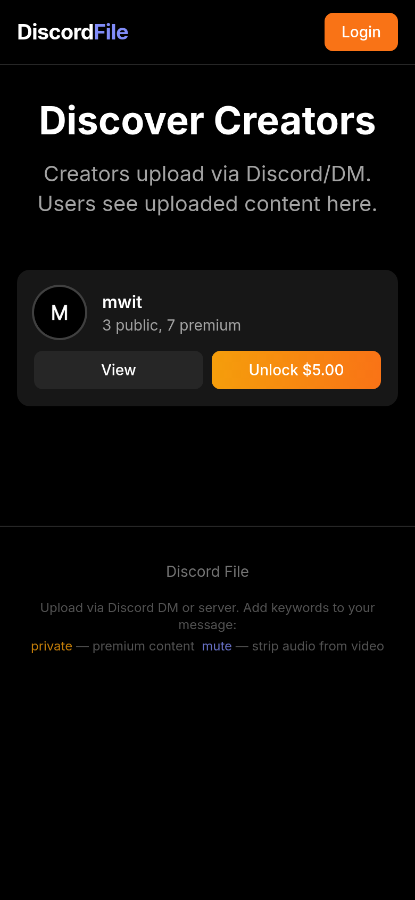
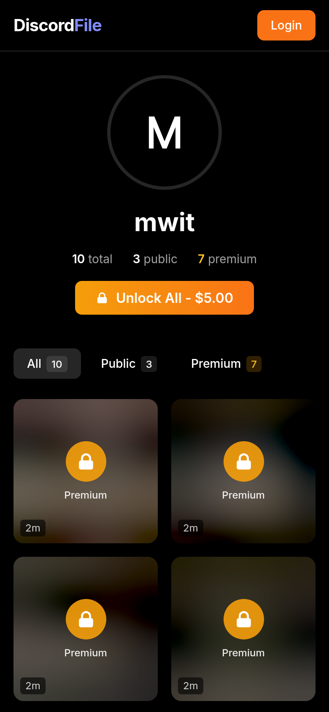
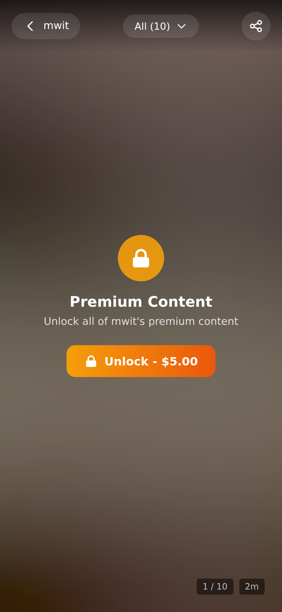

# Discord File

A Discord-based file hosting platform where creators upload files via a Discord bot and viewers pay to unlock private content.

## Screenshots

<p align="center">
  
  
  
</p>

*Mobile view: Home page, User profile with blurred premium content, TikTok-style fullscreen viewer*

## Features

- **Discord Bot Integration**: Upload files by sending them to the bot (DM = private, channel = public)
- **Stripe Payments**: One-time payment to unlock a creator's private content
- **Dual Auth System**: Creators login with Discord, viewers login with email (after purchase)
- **Privacy Protection**: EXIF metadata (GPS location, camera info, timestamps) is automatically stripped from images
- **Video Conversion**: Videos are automatically converted to MP4 for browser compatibility

## Quick Setup

Deploy on [hoston.ai](https://hoston.ai) - copy and paste this for the chat:

```
copy this project and setup https://github.com/buyhostname/discordfile.site
```

Or follow the [setup guide](./AGENTS.md) for manual installation.

## How It Works

1. **Creators** sign up with Discord OAuth
2. **Upload files** by sending them to the Discord bot
   - DM to bot = private file
   - Post in channel = public file
   - Start message with "private" = private file
   - Upload as spoiler = private file
3. **Viewers** browse public profiles
4. **Pay** via Stripe to unlock private content
5. **Return** anytime using email login

## Privacy & Security

- **EXIF data is automatically removed** from all uploaded images (JPG, PNG, WEBP, TIFF)
- This includes GPS coordinates, camera make/model, timestamps, and other metadata
- Protects creator privacy by preventing location tracking from photos

## Environment Variables

See [.env.example](./.env.example) for required configuration.
